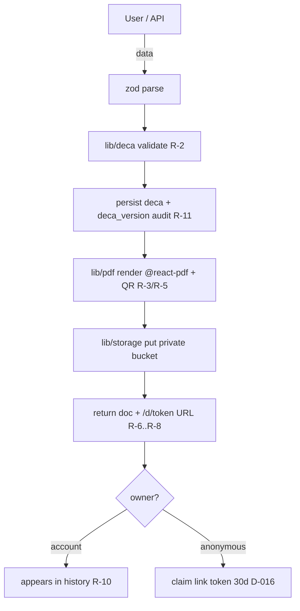

# Technical Plan — Farvertrans DeCA

## Stack (exact versions)
- **Runtime:** Node.js 20 LTS. **Language:** TypeScript 5.x (strict).
- **Framework:** Next.js 15 (App Router, React 19) — SSR/SSG for public pages, Route Handlers for the API.
- **DB:** PostgreSQL 15+ (Supabase managed). **Access:** Prisma 5.x for application tables + migrations; Supabase JS client only for Auth and Storage.
- **Auth:** Supabase Auth — passwordless email OTP (primary), optional password. Sessions via `@supabase/ssr` cookies.
- **Object storage:** Supabase Storage, **private** bucket `deca-pdfs`; PDFs are served only through the app's own `/d/[token]` route (never a public bucket URL) so headers, 7-day deactivation and enumeration protection are enforced in one place.
- **PDF:** `@react-pdf/renderer` 4.x — genuine text-based PDF from React components, embedded subset fonts, output well under 5 MB. **Never** headless-browser or image-to-PDF.
- **QR:** `qrcode` 1.x (PNG/SVG data URI embedded into the PDF via `@react-pdf`).
- **Validation:** `zod` — one schema module per domain, reused by API and forms.
- **Rate limiting / abuse:** Postgres-backed sliding-window limiter keyed on hashed IP + hashed client fingerprint; bot mitigation via a proof-of-work / hCaptcha challenge only when a soft threshold is crossed (invisible to normal users and inspectors).
- **Email:** Resend (transactional) — pinned at the Phase 5 scaffold; abstracted behind a `mailer` interface so it is swappable.
- **Analytics:** first-party events written to an `events` table; a tiny client beacon. No third-party analytics script in v1.
- **Testing:** Vitest (unit), Playwright (e2e), `axe-core` via `@axe-core/playwright` (a11y), `zod` schemas double as spec.
- **Lint/format:** ESLint (next/core-web-vitals + @typescript-eslint) + Prettier. Type check: `tsc --noEmit`.
- **Hosting:** Hostinger VPS, Ubuntu LTS, Docker + docker-compose (Next.js standalone server behind Caddy/nginx for TLS). Supabase is external managed.

### Why this stack
One codebase serves the indexable marketing/SEO pages (Next SSR/SSG) and the app. Supabase removes three services (DB, storage, auth) worth of ops for a solo maintainer under a hard deadline. `@react-pdf/renderer` is the one choice that directly satisfies the "native digital PDF, not a scan/image" rule (R-3) with small file size (R-4).

## Support matrix & budgets
- Browsers: last 2 versions of Chrome, Firefox, Safari, Edge; iOS Safari 16+; Android Chrome. Progressive enhancement — core content and the public document download work with no client JS.
- Node 20 LTS on the server. Postgres 15+.
- Performance budgets (public pages, mobile, p75): LCP < 2.0 s, INP < 200 ms, CLS < 0.1; JS transferred < 120 KB gzip on the landing; PDF generation server time < 1.5 s p95; public document download TTFB < 400 ms.
- PDF file size hard ceiling: 5 MB (R-4) — asserted in tests; target < 300 KB typical.

## Architecture
Components:
- **Public site** (`app/(site)/`) — SSR/SSG: landing, SEO cluster pages, legal/trust, FAQ, "am I obligated?" page. No auth. Emits analytics events.
- **DeCA engine** (`lib/deca/`) — pure: validation (R-2), document assembly, versioning rules (R-13), token generation, 7-day deactivation calc. No I/O. Heavily unit-tested (test-first).
- **PDF renderer** (`lib/pdf/`) — `@react-pdf` document component + QR embed + metadata (creation/modification timestamps, R-11).
- **App** (`app/(app)/`) — authed: create/edit/duplicate DeCA, history, corrections, saved entities, driver sharing, operator dashboard.
- **API** (`app/api/`) — Route Handlers: `POST /api/deca` (create), `POST /api/deca/[id]/version` (correct), `GET /d/[token]` (public download), `POST /api/claim/[token]`, `POST /api/events`, `POST /api/share`.
- **Attribution** (`lib/attribution/`) — pure: parse `ref` + UTMs, first-touch/last-touch merge rules; plus a thin cookie/session persistence layer.
- **Storage adapter** (`lib/storage/`) — wraps Supabase Storage; the only module that talks to the bucket.
- **Persistence** — Prisma schema owns all application tables; migrations are versioned and idempotent. Supabase Auth owns `auth.*`.

Data flow (create DeCA): form/API → `zod` parse → `lib/deca` validate + assemble → persist `deca` + `deca_version` rows (audit) → `lib/pdf` render → `lib/storage` put → return document with `/d/[token]` URL → QR in the PDF encodes that URL.

## Code map (keep current — future sessions orient HERE, never by scanning the tree)
State markers: `[E]` exists · `[A]` assistant to create in named slice/phase · `[G]` generated.

| Path | State | Purpose (one line) |
|---|---|---|
| `package.json` / `tsconfig.json` / `next.config.ts` | [A] P5 scaffold | project config, Next standalone output |
| `.env.example` | [A] P5 scaffold | documented env vars (Supabase URL/keys, DB URL, mailer, base URL) |
| `prisma/schema.prisma` | [A] P5 s1 | application tables (see Data model) |
| `prisma/migrations/` | [G] P5 | generated, versioned, idempotent |
| `app/(site)/page.tsx` | [A] P5 landing slice | the landing (EPIC 01) |
| `app/(site)/[cluster pages]/` | [A] P5 SEO slice | 10 core SEO pages (EPIC 03) |
| `app/(site)/layout.tsx` + `components/site/` | [A] P5 | site shell, persistent mobile CTA |
| `app/(app)/deca/new/page.tsx` | [A] P5 create slice | 3-step creation flow |
| `app/(app)/deca/[id]/page.tsx` | [A] P5 | document detail, corrections, share |
| `app/(app)/historial/page.tsx` | [A] P5 history slice | document history (R-10) |
| `app/(app)/datos/page.tsx` | [A] P5 saved-data slice | saved companies/vehicles/addresses |
| `app/(app)/operadores/page.tsx` | [A] P5 dashboard slice | internal operator dashboard (row 23) |
| `app/d/[token]/route.ts` | [A] P5 public-url slice | public direct PDF download (R-7/R-8/R-9) |
| `app/api/deca/route.ts` | [A] P5 create slice | create DeCA |
| `app/api/deca/[id]/version/route.ts` | [A] P5 versioning slice | correction → new version (R-13) |
| `app/api/claim/[token]/route.ts` | [A] P5 claim slice | attach anonymous DeCA to account (D-016) |
| `app/api/share/route.ts` | [A] P5 share slice | build WhatsApp/email share payloads |
| `app/api/events/route.ts` | [A] P5 tracking slice | first-party analytics ingest |
| `lib/deca/validate.ts` `assemble.ts` `version.ts` `token.ts` `deactivation.ts` | [A] P5 (test-first) | the pure engine |
| `lib/pdf/DecaDocument.tsx` `render.ts` `fonts/` | [A] P5 pdf slice | the compliant PDF |
| `lib/attribution/parse.ts` `merge.ts` `persist.ts` | [A] P5 tracking slice | ref + UTM attribution (EPIC 02) |
| `lib/storage/index.ts` | [A] P5 | Supabase Storage adapter |
| `lib/abuse/limiter.ts` `challenge.ts` | [A] P5 abuse slice | rate limit + challenge (row 19) |
| `lib/auth/` | [A] P5 auth slice | Supabase SSR session helpers, attribution capture on signup |
| `lib/i18n/es.ts` | [A] P5 | the es-ES string catalog (D-002) |
| `content/seo/*.mdx` | [A] P5 SEO slice | SEO page content + frontmatter (title/meta/canonical) |
| `app/sitemap.ts` `app/robots.ts` | [A] P5 SEO base slice | sitemap.xml, robots.txt |
| `tests/unit/` `tests/e2e/` `tests/compliance/` | [A] P5 | Vitest + Playwright + the R-1..R-13 suite |
| `scripts/` (keel-verify, keel-doctor, keel-close, keel-handoff-verify, keel-chain-check, keel-session-pid.sh, build) | [A] P5 scaffold | Keel scaffolding |
| `.githooks/pre-commit` `.githooks/post-commit` | [A] P5 scaffold | confidential-data gate + hand-off delete |
| `.github/workflows/ci.yml` | [A] P5 scaffold | CI on main (D-010) |
| `.claude/rules/` `.claude/agents/` | [A] P2 close | assistant config (D-010) |

## Change map (what a change of each type must touch)
| Change type | Touch always |
|---|---|
| New user-facing string | add to `lib/i18n/es.ts` with a key; never inline literal; guide copy if visible there |
| New DeCA data field | `lib/deca/validate.ts` (zod + R-2 check), `prisma/schema.prisma` + migration, `lib/pdf/DecaDocument.tsx`, the compliance test in `tests/compliance/`, `docs/flows/create-deca.md`, changelog |
| New API route / Route Handler | `zod` input schema, auth/permission check, rate-limit check where public, `docs/api/` entry + INDEX row, a permission-failure test + an invalid-input test |
| New public function/module in `lib/` | `docs/api/` entry + INDEX row, runnable example, unit test (test-first for pure logic) |
| Changed public signature | update the `docs/api/` entry (params/return/errors), re-run its example, changelog |
| New DB table or column | `prisma/schema.prisma` + idempotent migration, `docs/architecture.md`, retention/deletion behaviour noted, `docs/threat-model.md` if it holds personal data |
| New SEO page | `content/seo/*.mdx` with unique title/meta/canonical/OG, internal links to landing + requisitos + FAQ + generador, `app/sitemap.ts` entry, one H1, last-reviewed date, BOE citation |
| New analytics event | `lib/analytics/events.ts` enum, emit site, `docs/02-functional-spec.md` event list, privacy/cookies notice if it changes what is collected |
| Front-end asset (JS/CSS) edited | edit source, run the build script to regenerate `*.min.*`, commit the pair |
| New dependency | `docs/decisions.md` entry with alternatives + license (permissive only — D-003), support matrix if it moves a floor |
| Version bump | all Version touchpoints below, `CHANGELOG.md` |
| New env var | `.env.example`, `docs/03-technical-plan.md`, deploy runbook, fail-closed check on boot |

## Conventions
- **Prefix/namespace:** no global prefix needed (module-scoped TS). DB tables singular-snake (`deca`, `deca_version`, `operator`). Env vars `FVD_*` for app-specific, `NEXT_PUBLIC_FVD_*` for client-exposed.
- **Naming:** files kebab-case; React components PascalCase; functions camelCase; zod schemas `xSchema`; test files `*.test.ts` (unit) / `*.spec.ts` (e2e).
- **Error handling:** Route Handlers return a typed `{ error: { code, message } }` with the right HTTP status; `lib/` throws typed errors (`DecaValidationError`, `AbuseLimitError`, `StorageError`); never leak internals to the client. The DeCA engine **fails closed** — if validation, rendering or storage fails, no document is emitted and the user sees a clear Spanish error (never a partial/non-compliant PDF).
- **Logging:** `pino` structured logs, levels error/warn/info/debug. `FVD_DEBUG=1` enables debug. **Never log**: full personal data of shippers/carriers/drivers, tokens, Supabase keys, session cookies. Access logs for `/d/[token]` store only a hashed IP + timestamp + document id (R-11 audit minimalism).
- **Timestamps:** all UTC in the DB; creation & every modification recorded on `deca_version` (R-11).

## Testing
- **Unit:** Vitest — `npm run test:unit`. Covers `lib/deca/*`, `lib/attribution/*`, `lib/abuse/*`, `lib/pdf/render` size/format assertions, zod schemas. Test-first for all pure logic (D-014).
- **Integration:** Vitest against a disposable Postgres (Docker) — `npm run test:int`. Covers Prisma migrations idempotency, versioning persistence, claim flow, rate limiter.
- **E2E:** Playwright — `npm run test:e2e`. Covers: landing renders server-side with one H1 and the CTA to the creation flow (not contact); create a DeCA end to end (anonymous + authed); scan-equivalent — fetch the QR's URL and assert a direct PDF download with no auth, no interstitial, correct content-type/disposition; correction produces a new version and preserves the old; driver share payloads; signup carries the `ref`/UTM attribution; operator dashboard numbers.
- **Compliance suite:** `tests/compliance/` (Vitest + pdf parsing) — `npm run test:compliance`. One test per R-1…R-13: PDF < 5 MB; PDF is native (text extractable, not a single image); QR present, decodable, and its payload equals the document URL; URL is HTTPS in prod config; URL downloads the PDF directly with no auth; creation + modification timestamps recorded and retrievable; document retrievable ≥ 1 year (simulated); prior version not lost after a correction; 7-day deactivation flips access after the window. **This suite is a Phase 7 release gate.**
- **Verification playground:** `docker-compose.yml` — Next.js dev + a local Postgres + a Supabase-storage stub (or a real Supabase dev project). Seed script `npm run seed` inserts synthetic operators, companies, vehicles and a few sample DeCA (never real data); reset `npm run seed:reset`. Access + try-it steps in `docs/playground.md`.
- **Driver per surface:**

| Surface | Driver | Headless? | Evidence |
|---|---|---|---|
| Public site pages (landing, SEO, FAQ) | Playwright (chromium) | yes | trace + video + axe report + Lighthouse JSON |
| DeCA creation flow (app) | Playwright | yes | trace + video + DB row assertions |
| Public document URL `/d/[token]` | Playwright + raw fetch | yes | response headers, body hash, status codes |
| API Route Handlers | Playwright `request` / Vitest | yes | request/response logs, status assertions |
| PDF output | Vitest + `pdf-parse` / `pdfjs` | yes | extracted text, embedded image list, byte size, QR decode |
| Real QR scan with a phone camera | — | **no** | `HARDWARE` — user scans the QR from a generated PDF on a real phone and confirms it opens the PDF directly (see Division of labour) |
| WhatsApp / email delivery on real devices | — | **no** | `HARDWARE` — user sends a share to their own phone/inbox and confirms it opens |
| Legal acceptance of a generated DeCA | — | **no** | `EXTERNAL-APPROVAL` — user or an adviser confirms a real document is accepted at inspection standard |
| Supabase project provisioning, domain/DNS/TLS, deploy | — | **no** | `CREDENTIAL` — user holds the Hostinger + Supabase + domain + email-provider accounts |

- **Run mode & recording:** Playwright headless by default; `npm run test:e2e:headed` runs the same suite headed and slowed for watching. `trace: 'on'`, `video: 'on'`, `screenshot: 'only-on-failure'`; artifacts in `test-results/`, retained 7 days locally / on the CI artifact.
- **Element addressability:** every interactive element carries `data-testid` in `kebab-case` describing role + intent (`data-testid="deca-submit"`). Tests bind to `data-testid` or ARIA role, never to visible Spanish text. Accessibility labels are never faked for tests.
- **Division of labour:** the assistant drives every web/API/PDF surface end to end. Legs it cannot: `HARDWARE` — real phone QR scan; real-device WhatsApp/email open. `EXTERNAL-APPROVAL` — legal sign-off that a generated DeCA passes inspection; RGPD review of anonymous-document retention (D-016). `CREDENTIAL` — Supabase/Hostinger/domain/email accounts and all deploy steps. Each leg has step-by-step instructions in `docs/playground.md` / the Phase 4 external-setup walkthrough; a tag covers only that leg.
- **Static analysis:** `npm run lint` (ESLint), `npm run typecheck` (`tsc --noEmit`), `npm run format:check` (Prettier) — all run at every test point and in CI.
- **Accessibility automation:** `@axe-core/playwright` audit per public page and per app screen, and per state (empty form, validation-error, success); a driven keyboard/focus-order pass in the e2e suite for the creation flow and the landing CTA.
- **Read-back duty:** Playwright fixtures fail the test on any `console.error`, uncaught exception, failed request, or 5xx response during the run; the server's `pino` error log is asserted clean per e2e scenario.
- **Real exercise per flow:** `docs/playground.md` lists the exact URL / command for: create anonymous DeCA, claim it, create authed DeCA, correct a DeCA, download via `/d/token`, share to driver, visit `/?ref=adrian&utm_source=whatsapp` then sign up and check attribution, open the operator dashboard.
- **Debug logging:** `FVD_DEBUG=1` env var toggles `pino` debug level; ON in dev, OFF in the release image. Verified at the Phase 7 gate.
- **Performance budget measurement:** Lighthouse CI in the e2e job against the built site for the budgets above; `@react-pdf` render timing asserted in the compliance suite.
- **Regression rule:** every bug fixed gets a failing test first, linked from `docs/lessons-learned.md`.
- **Test-first policy:** `pure-logic` (D-014) — pure logic in `lib/deca`, `lib/attribution`, `lib/abuse`, and zod schemas gets its test written and seen failing before the code. Markup, Next glue, Supabase/Prisma integration exempt (spike-then-pin where behaviour is unknown).

## Environment requirements (the source of scripts/keel-doctor)
| Requirement | Required version/state | Severity | Install (Windows dev / Linux VPS) |
|---|---|---|---|
| Node.js | 20 LTS (>=20.11) | blocking | Windows: nvm-windows / winget `OpenJS.NodeJS.LTS`; Linux: nodesource / nvm |
| npm | bundled with Node 20 | blocking | bundled |
| Docker + docker-compose | Engine 24+, daemon running | blocking (playground, integration tests, deploy) | Windows: Docker Desktop (⚠ licensing depends on company size/revenue — user's call); Linux: Docker Engine (`docker` group ≈ root — flag to user) |
| Git | 2.40+ | blocking | present |
| GitHub CLI `gh` | any recent, authenticated | optional (issue automation) | present, authenticated |
| Playwright browsers | chromium (+ firefox, webkit for full matrix) | blocking (e2e) | `npx playwright install --with-deps` |
| A Supabase project (dev) | free tier ok | blocking to run against real Supabase; a local stub covers most tests | `CREDENTIAL` — user creates it; cannot be installed |
| Hostinger VPS | Ubuntu LTS, ≥ 2 GB RAM (size in P5) | blocking for deploy only | `CREDENTIAL` — user provisions |
| Domain + DNS | user-owned | blocking for launch only | `CREDENTIAL` — user owns; placeholder `deca.farvertrans.es` until then |
| Transactional email account (Resend) | API key | blocking for email flows | `CREDENTIAL` — user creates |
| Lighthouse CI | `@lhci/cli` (dev dep) | optional | `npm i` |

Cannot be installed on this machine at all: the Apple/Windows-native toolchains (not needed — web only). Supabase/Hostinger/domain/email are accounts, not installs — the doctor reports them as `CREDENTIAL` stops with links, never attempts them.

## Tooling commands
- lint: `npm run lint` · typecheck: `npm run typecheck` · format check: `npm run format:check`
- test: `npm run test:unit` · `npm run test:int` · `npm run test:e2e` · `npm run test:compliance` · all: `npm test`
- build: `npm run build` (Next standalone) · start: `npm start`
- playground: `npm run dev` + `docker compose up -d db` · seed: `npm run seed` · reset: `npm run seed:reset`
- front-end asset build: Next handles JS/CSS bundling + minification at `npm run build`; there are **no hand-authored `*.min.*` pairs** in this project (framework-bundled), so the source-first-minified pairing rule is satisfied by the build pipeline — recorded here per SKILL.md.
- DB: `npx prisma migrate dev` (dev) · `npx prisma migrate deploy` (prod)

## Version touchpoints
- `package.json` `version`
- `CHANGELOG.md` heading
- a `src/version.ts` `APP_VERSION` constant (shown in the footer + sent with analytics events)
Phase 7 syncs all three.

## License & dependency compatibility
- Project: proprietary / UNLICENSED (D-003). Rule: every dependency's license verified permissive (MIT/BSD/Apache-2.0/ISC) BEFORE adoption; GPL/AGPL runtime deps not adopted without a D-entry. `@react-pdf/renderer` (MIT), `qrcode` (MIT), `zod` (MIT), Prisma (Apache-2.0), Next.js (MIT), Supabase JS (MIT) — all clear.
