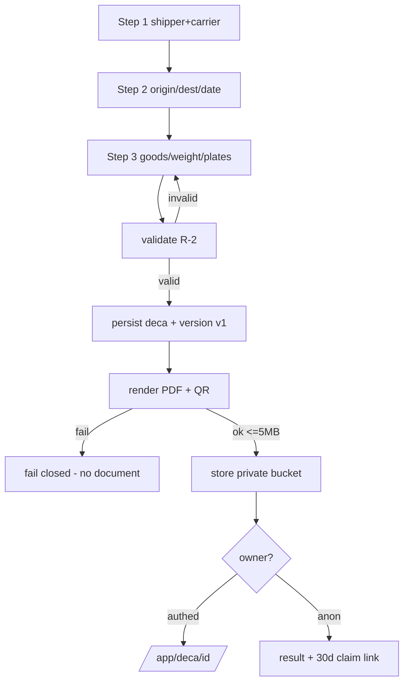

# Flow — Create a DeCA (F1)

Trigger: "CREAR DECA GRATIS" from the landing / any CTA, or "Nuevo DeCA" in the app.

1. User opens `/app/deca/new`. System renders step 1.
2. Step 1 — shipper + carrier (name/razón social, NIF, address). Validate on "Siguiente" (zod + R-2). Authed: autofill from saved entities (F7).
3. Step 2 — origin, destination, date of transport. Validate on advance.
4. Step 3 — goods nature, weight (or alternative measure), plate(s) (tractor + trailer if articulated).
5. User → "Generar DeCA".
6. System: `lib/deca/validate` (R-2) → persist `deca` + `deca_version` v1 (server UTC timestamp, R-11) → `lib/pdf` render (@react-pdf, embed QR of the public URL, PDF metadata) → assert ≤ 5 MB (R-4) → `lib/storage` put to the private bucket.
7. System → user: authed → redirect to `/app/deca/[id]`. Anonymous → result page with download, QR, driver share, and the 30-day claim link (F6).
8. System emits `deca_generated` with the ref/UTM snapshot.

Branches:
- Anonymous and over the F16 soft threshold → challenge before step 6; on pass, continue.
- Not articulated → trailer plate hidden/optional.

Failure paths:
- Validation fails at any step → inline field errors, no advance (AC-02).
- Render or storage throws at step 6 → fail closed: nothing persisted as valid, no partial PDF, Spanish error, retry (AC-03).
- Size > 5 MB → hard error, no document.

