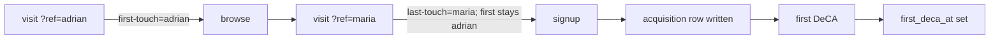

# Flow — Signup carrying acquisition attribution (F10, F12, EPIC 02)

Trigger: any visit, possibly `https://<domain>/?ref=<code>&utm_source=…&utm_medium=…&utm_campaign=…&utm_content=…&utm_term=…`

1. On every page load, `lib/attribution/parse` extracts `ref` + all five UTMs; `merge` applies:
   - first-touch: stored once (first-party cookie + localStorage + server session); NEVER overwritten thereafter;
   - last-touch: updated on each new qualifying visit BEFORE signup;
   - no `ref` and no UTM → attribution = organic/direct, from the referrer.
2. User browses — attribution persists across navigation (AC-19).
3. User → signup (email OTP) + company name.
4. On `signup_completed`: write one `acquisition` row — first/last `ref_code`, first/last UTMs, first landing URL, `first_seen_at`, `signup_at`. Emit `signup_started` / `signup_completed`.
5. On the user's first generated DeCA: set `acquisition.first_deca_at`.

Rules:
- The user never sees and never types an operator name (AC-18).
- Unknown `ref` code → stored as-is, flagged "unknown operator" in the dashboard.
- `first_ref_code` immutable after signup (AC-20).

